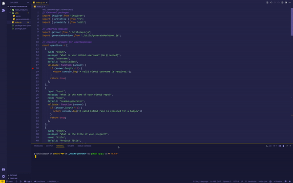

# README.md Generator with Node.js and ES6+

## Description

This is a command line interface application which creates a README file for your application repositories. This will allow people to understand how your app works, how to install it, and how other developers can contribute to your project.

## Table of Contents
  * [Installation](#installation)
  * [Usage](#usage)
  * [Questions](#questions)
  * [License](#license)
    
## Installation
   
_Follow these steps to properly install this application:_

To generate your own README, `git clone` the repo down to your local so you have the Node project on your local.

Run `npm install` in order to install the following npm package dependencies as specified in the `package.json`:

* [`inquirer`](https://www.npmjs.com/package/inquirer) will prompt you for your inputs from the command line.
* [`axios`](https://www.npmjs.com/package/axios) will fetch your info from the GitHub API.

The application will start by running `node index.js` in the command line.

Answer the prompts in your command line to generate the README.

After answering all the prompts, your README file will be ready for you at the root of the repo.

The README has some automatically generated badges for your repo courtesy of shields.io and will include your Github profile information.

## Usage

_Instructions for use:_

When you run `node index.js`, the application uses the `inquirer` package to prompt you in the command line with a series of questions about your GitHub and about your project.

The application then takes your responses and uses `axios` to fetch your GitHub profile from the [GitHub API](https://developer.github.com/v3/), including your GitHub profile information.

From there, the application will generate markdown and a table of contents for the README conditionally based on your responses to the Inquirer prompts (so, if you don't answer the optional questions, such as Installation, an Installation section will not be included in your README). The README will also include badges for your GitHub repo.

Finally, `fs.writeFile` is used to generate your project's README.md file.

## Questions
      
_For further questions:_

If you have any questions, or additional feedback, please feel free to email me and I will respond as soon as possible.

_Contact Info:_

GitHub: [danieladdsn](https://github.com/danieladdsn)

Email: [daniel9addison@gmail.com](mailto:daniel9addison@gmail.com)
    
## License
     
MIT License
